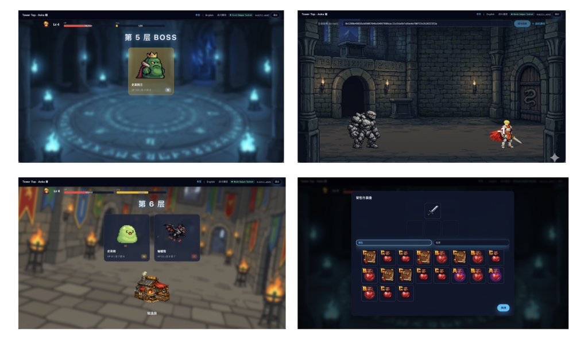
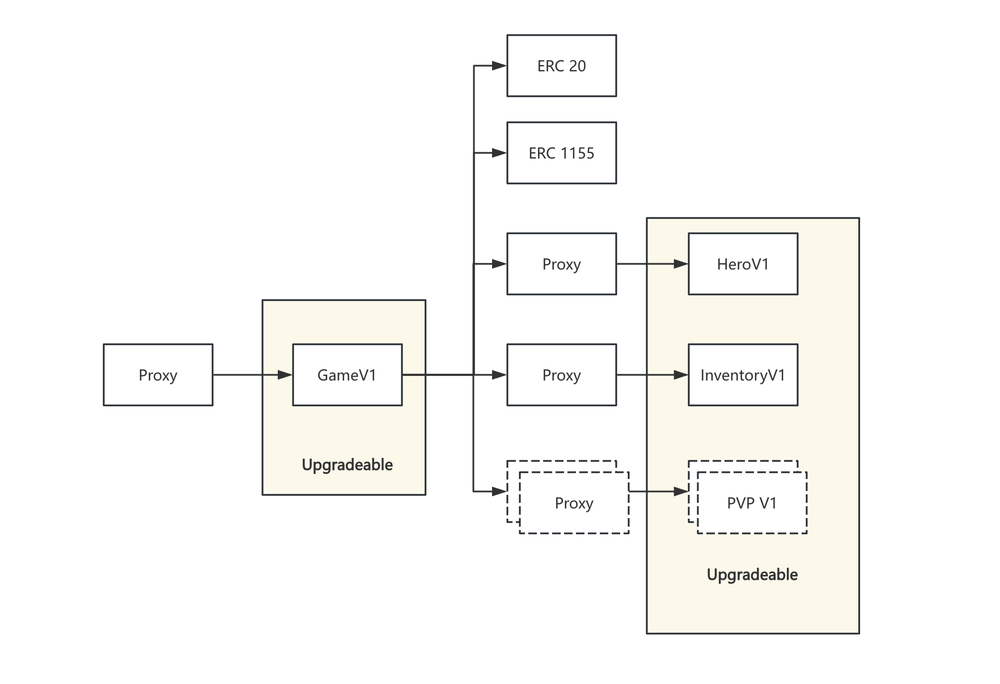

## Aoka Tower GameFI

Aoka Tower is an Ethereum‑based tower‑climbing GameFI project.  
The player starts on floor 1 and climbs up to floor 100 by defeating monsters, challenging BOSSes, and acquiring or upgrading equipment.

**status:** In Development, deployed on Polygon Amoy Testnet

**GameProxy:** [0x63bbEc3528D2dcb604ADE938782D16C63f0174A7](https://amoy.polygonscan.com/address/0x63bbEc3528D2dcb604ADE938782D16C63f0174A7)

**GameV1:** [0x8420A0FA02ADbF0f4c1eb663335dd2A981422092](https://amoy.polygonscan.com/address/0x8420A0FA02ADbF0f4c1eb663335dd2A981422092)

**HeroProxy:** [0xf55174c2fC4159B0d89Ad2BB36cB42C7fECD005b](https://amoy.polygonscan.com/address/0xf55174c2fC4159B0d89Ad2BB36cB42C7fECD005b)

**HeroV1:** [0x2EA385c2566516d75DD0dcb4D6AfCeCcA5f0E657](https://amoy.polygonscan.com/address/0x2EA385c2566516d75DD0dcb4D6AfCeCcA5f0E657)

**InventoryProxy:** [0x7F2cE96023B8F66aBf325E656Aa4Fa58E202cbc2](https://amoy.polygonscan.com/address/0x7F2cE96023B8F66aBf325E656Aa4Fa58E202cbc2)

**InventoryV1:** [0xbE11aE82119d976689E927EDad650ab25Fab9474](https://amoy.polygonscan.com/address/0xbE11aE82119d976689E927EDad650ab25Fab9474)

**ERC20 (GameToken):** [0x6aF282942487f79a8F5A33fA750C09475707368A](https://amoy.polygonscan.com/address/0x6aF282942487f79a8F5A33fA750C09475707368A)

**ERC1155 (GameAssets):** [0x557A79c517EB114E6A27f9c41DCfAb9A292dD4c0](https://amoy.polygonscan.com/address/0x557A79c517EB114E6A27f9c41DCfAb9A292dD4c0)

### Core Gameplay

- **Tower Progression**
  - 100 floors in total, player starts from floor 1.
  - Every 5th floor (5/10/15/…) is a BOSS floor; defeating the BOSS unlocks the next segment of floors.

- **Combat & Growth**
  - On normal floors, the player sees several options (monsters, shop, forge, etc.) and can enter **only one** per floor.
  - Defeating monsters and BOSSes grants experience, gold, and items; leveling up increases HP, attack, and defense.
  - Combat includes critical hits, block, stun, and elemental advantage; all numbers are aligned with on‑chain contracts.

- **Items & Equipment**
  - Items: books (grant experience), potions (restore HP), refresh stones, and more.
  - Equipment: swords (attack), shields (block/defense), and armors (defense), with level 1–25 and rarity C/B/A/S.
  - Materials (Wooden / Iron / Obsidian) interact with enemy elements (Fire / Earth / Electric) to provide damage bonuses when advantageous.

- **Economy**
  - Gold is the in‑game currency, used for shop purchases and forge upgrades/merges.
  - Spending can partially burn gold and partially feed a reward pool for leaderboards and future GameFI mechanics.
  - A Puppet periodically accumulates a small amount of gold for the player and decays if not claimed for a long time.

### Documentation

- **[Game design document 游戏设计文档](docs/GAME_DESIGN.md)** – Full game design (mechanics, formulas, economy, combat, floors, shop/forge). Includes technical notes on UUPSUpgradeable proxy, Two-Step ownership, Game/Hero/Inventory split, and contract architecture.

---

## Preview

---
## Contracts & Architecture


The game uses **three proxies** (Game, Hero, Inventory), each with logic/storage separation. Users interact only with the **Game proxy**; Hero and Inventory are callable only by the Game proxy (`setPermit`).

### Entry point (behind proxy)

| Contract   | Path              | Description |
|-----------|-------------------|-------------|
| **GameV1** | `src/GameV1.sol`  | Game logic implementation: inherits GameLogic, UUPSUpgradeable, Ownable2StepUpgradeable. `initialize(heroLogic, inventoryLogic, gameToken, gameAssets, protocol, vrfCoordinator, keyHash, subscription, owner)`. Uses ERC1967Proxy with UUPS; only owner can upgrade via `upgradeToAndCall`. Ownership uses two-step transfer (transferOwnership → acceptOwnership). |

### Core contracts

| Contract       | Path                | Description |
|----------------|---------------------|-------------|
| **GameLogic**  | `src/GameLogic.sol` | Abstract: single entry for born, battle, nextFloor, buy, equip, deposit/withdraw, etc.; delegates to HeroLogic and InventoryLogic, and mints/burns token and assets. |
| **HeroLogic** / **HeroV1** | `src/HeroLogic.sol`, `src/HeroV1.sol` | Player state, floor state, equipped slots, combat. HeroV1 inherits UUPSUpgradeable and Ownable2StepUpgradeable; only the Game proxy may call it after `setPermit(gameProxy)`. Owner can upgrade via `upgradeToAndCall`. |
| **InventoryLogic** / **InventoryV1** | `src/InventoryLogic.sol`, `src/InventoryV1.sol` | Bag, warehouse, equipment/items, shop and forge logic. InventoryV1 inherits UUPSUpgradeable and Ownable2StepUpgradeable; only the Game proxy may call it. Owner can upgrade via `upgradeToAndCall`. |
| **ERC1967Proxy** | `src/ERC1967Proxy.sol` | ERC1967 proxy used for Game, Hero, and Inventory. Inherits UUPSUpgradeable for upgrade authorization; owner calls `upgradeToAndCall` to upgrade the implementation. |
| **GameAssets** | `src/GameAssets.sol`| ERC1155: equipment, items, gold. Only the Game proxy can mint/burn after `setProxy(gameProxy)`. |
| **GameToken**  | `src/GameToken.sol` | ERC20 “Aoka Tower Token” (ATT). Only the Game proxy can mint/burn after `setProxy(gameProxy)`. |

### Interfaces

| Interface     | Path                        | Description |
|---------------|-----------------------------|-------------|
| **IGameLogic**| `src/interfaces/IGameLogic.sol` | External game API (born, battle, nextFloor, buy, equip, deposit, etc.) and custom errors. |
| **IHeroLogic**| `src/interfaces/IHeroLogic.sol` | Hero module: getPlayer, getFloor, getEquippedIds, setPermit; used by Game and tests. |
| **IInventoryLogic**| `src/interfaces/IInventoryLogic.sol` | Inventory module: getBag, getWarehouse, getEquipment, setPermit; used by Game. |
| **IGameToken**| `src/interfaces/IGameToken.sol` | Token operations and permit; used by game for mint/burn. |
| **IGameAssets**| `src/interfaces/IGameAssets.sol`| Asset mint/burn; used by game. |

### Libraries

| Library        | Path                          | Description |
|----------------|-------------------------------|-------------|
| **Battle**    | `src/libraries/Battle.sol`    | Turn‑based combat, damage formula, reward generation. |
| **Character** | `src/libraries/Character.sol` | Player struct, level‑up and circle logic. |
| **Enemy**     | `src/libraries/Enemy.sol`     | Enemy (Aoka) struct and floor enemy generation. |
| **Property**  | `src/libraries/Property.sol`  | Equipment/item IDs, stats, merge/upgrade cost and probability. |
| **Environment**| `src/libraries/Environment.sol`| Floor, shop, forge, and floor‑option generation. |
| **Attribute** | `src/libraries/Attribute.sol` | Rarity enum and related types. |
| **FloorIndex**| `src/libraries/FloorIndex.sol` | Boss‑floor check (`isBossFloor`). |
| **Seed**      | `src/libraries/Seed.sol`      | Seed mixing for reproducible on‑chain randomness. |

### Randomness

| Contract | Path | Description |
|----------|------|-------------|
| **PREVRANDAO** | `src/libraries/Randao.sol` | Wraps `block.prevrandao` for on-chain RNG used in combat, floor generation, shop, and forge. |
| **VRF** | `src/GameLogic.sol` | Chainlink VRF V2 Plus integration: after a player wins a battle, the contract requests random words from VRF to determine loot rewards. The `fulfillRandomWords` callback mints assets directly without a backend. |

**VRF Architecture:**

- `GameV1.initialize()` accepts `_vrfCoordinator_`, `_keyHash_`, and `_subscription_` parameters.
- `GameLogic` inherits `VRFConsumerBaseV2Upgradeable` and implements `fulfillRandomWords`.
- On battle victory → `_requestRandomWordsForReward()` sends a VRF request with `numWords=1`, `callbackGasLimit=250000`, `requestConfirmations=5`.
- VRF coordinator calls back `fulfillRandomWords(requestId, randomWords)` → `InventoryLogic.rewardWinner()` → `_gameAssets.mintBatch()`.
- A `mapping(uint256 requestId => RewardWinner)` stores pending reward state; `floorIndex == uint256.max` marks a processed request to prevent reentrancy.
- Test suite uses `VRFCoordinatorV2_5Mock` from `@chainlink`; deployment uses real VRF subscription via `.env` (`VRF_COORDINATOR`, `VRF_KEY_HASH`, `VRF_SUBSCRIPTION`).

### UUPS Upgradeable Proxy

The game uses **UUPS (Universal Upgradeable Proxy Standard)** pattern for all upgradeable contracts:

|| Contract | Upgrade Mechanism |
||----------|------------------|
|| **GameV1** | Owner calls `upgradeToAndCall(newImplementation, data)` on the proxy |
|| **HeroV1** | Owner calls `upgradeToAndCall(newImplementation, data)` on the proxy |
|| **InventoryV1** | Owner calls `upgradeToAndCall(newImplementation, data)` on the proxy |

**Key differences from Transparent Proxy:**
- UUPS embeds upgrade authorization in the implementation contract (via `_authorizeUpgrade`), not in the proxy
- Gas efficient: no separate admin slot, upgrade logic lives in implementation
- Each implementation must inherit `UUPSUpgradeable` and implement `_authorizeUpgrade`

### Two-Step Ownership Transfer

All upgradeable contracts use **Ownable2StepUpgradeable** for enhanced security:

1. **Initiate transfer**: Current owner calls `transferOwnership(newAddress)`
2. **Accept ownership**: Pending owner calls `acceptOwnership()` to finalize
3. **Cancel**: Current owner can call `cancelOwnershipTransfer()` before acceptance

This prevents accidental loss of contract control if an wrong address is provided during ownership transfer.

---

## Scripts

| Script | Description |
|--------|-------------|
| **DeployGame** | `script/DeployGame.s.sol` – Deploy GameToken, GameAssets, GameV1, HeroV1, InventoryV1 and their ERC1967Proxy (UUPS); initialize and wire `setPermit` / `setProxy` so the game proxy is the single entry. Ownership uses two-step transfer. |

---

## Tests

Tests use **RouterTestBase**, which deploys the full stack: Game, Hero, and Inventory proxies plus GameToken and GameAssets. All under `test/`:

| Test file | Coverage |
|-----------|----------|
| `Born.t.sol` | Player creation (born), initial state, floor 0. |
| `Battle.t.sol` | Combat, damage, level‑up, BOSS, death, not‑registered reverts. |
| `Buy.t.sol` | Shop purchase (items, equipment), reverts. |
| `DepositWithdraw.t.sol` | Deposit, withdraw, 5% burn, depositWithPermit. |
| `EquipUnequip.t.sol` | Equip / unequip equipment and puppet. |
| `FullHeal.t.sol` | Full‑heal cost and reverts. |
| `UseItems.t.sol` | Use items (potions, books), slot rules. |
| `Circle.t.sol` | Circle (rebirth at floor 100), reverts. |
| `TowerTopSimulation.t.sol` | End‑to‑end simulation: one player climbs and fights until cap or level 100. |
| `GameInvariant.t.sol` | Invariant: player level and floor index bounded. |

Run: `forge test`

---

## Local Development (Foundry)

This project uses [Foundry](https://book.getfoundry.sh/) (`forge`, `cast`, `anvil`, etc.) as the main development and testing toolkit.

### Prerequisites

Install Foundry by following the official guide:

- https://book.getfoundry.sh/

### Common Commands

- **Build**

  ```shell
  forge build
  ```

- **Run Tests**

  ```shell
  forge test
  ```

- **Run battle simulation** (TowerTopSimulation: one player climbs and fights until top or stuck; uses books, potions, fullHeal, buy/upgrade when possible; prints final state)

  ```shell
  forge test --match-path test/TowerTopSimulation.t.sol -vv
  ```

- **Format Solidity**

  ```shell
  forge fmt
  ```

- **Gas Snapshots**

  ```shell
  forge snapshot --match-test "test_.*_for_snapshot"   
  ```

- **Local Node (Anvil)**

  ```shell
  anvil
  ```

- **Scripts / Deployment**

  Deploy script: `script/DeployGame.s.sol` deploys GameToken, GameAssets, GameV1, HeroV1, InventoryV1 and their ERC1967Proxy (with UUPSUpgradeable), wires `setPermit` and `setProxy`, then the game proxy is the single entry for users. Ownership uses two-step transfer (transferOwnership → acceptOwnership). Set env vars (e.g. `OWNER_ADDRESS`, deployer keys) or use `--private-key` as needed:

  ```shell
  forge script script/DeployGame.s.sol --rpc-url <your_rpc_url> --broadcast
  ```

- **Cast Utility**

  ```shell
  cast <subcommand>
  ```

For more details about Foundry itself, please refer to the official documentation:  
https://book.getfoundry.sh/
